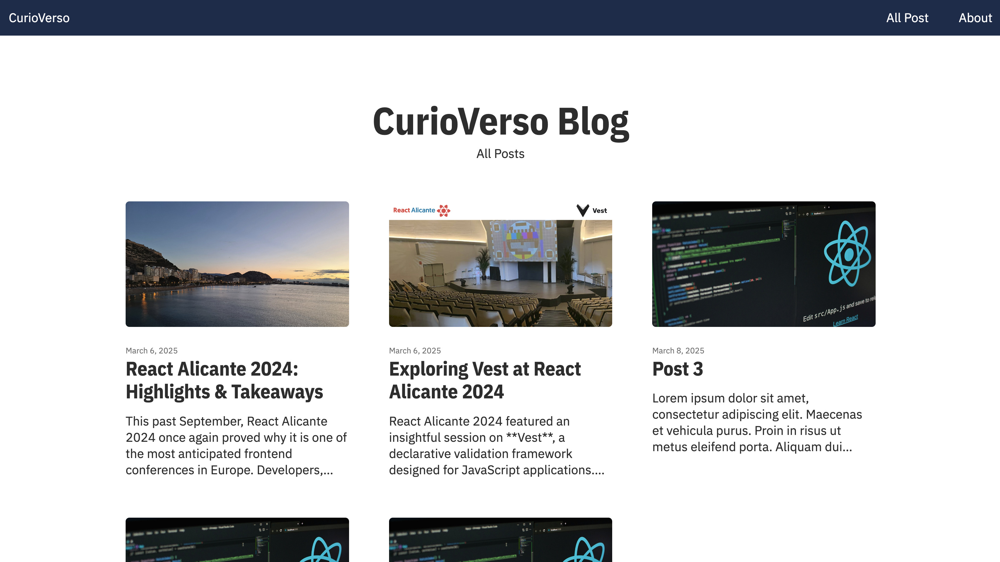

# 1. Arrancando el proyecto

## Headless CMS

Montar un blog es el ejemplo perfecto para entender cómo funciona **Astro** y **Content Island**. Es un proyecto sencillo pero con lo suficiente para jugar con rutas, contenido dinámico y un poco de interactividad.

Además, tener tu propio blog nunca es mala idea, sobre todo si quieres algo ligero, sin anuncios que no controles, y completamente personalizable.

Vamos a implementar una semilla sencilla:

- 📜 Una página con un listado de posts.

- ✍️ Una página para ver cada post en detalle.

- 👤 Una página sobre nosotros, porque siempre viene bien presentarse.

El resultado final, tendría este aspecto.

Una opcíon para desarrollar esto sería tirar con HTML/CSS puro y duro, pero, claro, queremos que esto esté vivo. No quiero estar liado con el HTML cada vez que quiera cambiar un dato de mi bio, corregir un error o añadir un post nuevo. Es más, me gustaría que incluso una persona que no supiera programar pudiera introducir nuevos posts o modificar los datos que fueran pertinentes, pero eso sí, quiero lo mejor de los dos mundos, por un lado la velocidad y sencillez de tener HTML y CSS estático por otro lado de poder modificar los datos de forma sencilla.

¿Qué puedo hacer? Definir un módelo de mi aplicación en **Content Island**, introducir los datos y, utilizando una tecnología como **Astro**, generar un sitio estático y actualizarlo cada vez que haya un cambio en la información en mi proyecto de **Content Island**.

## Creando el proyecto en Content Island

Vamos a empezar a crear el proyecto desde cero.

Una vez que hemos hemos creado nuestra cuenta en **Content Island** y hacemos login, dependiendo de tu rol:

- O bien verás una ventana en la que puedes elegir entre los proyectos a los que tienes acceso o editar usuarios, en este caso elegimos ir a la lista de proyectos.

- O bien verás directamente la lista de proyectos (si es la primera vez que entras, estará vacía).

\*\*
Le damos a añadir proyecto.

Se nos muestra una pestaña "General" en la que tenemos que darle un nombre al proyecto, tecleamos: "my-blog" y le damos al botón de guardar.

Ahora nos pide que generemos un token de API (esto será lo que usemos para consumir los datos de nuestro proyecto desde **Astro**), le damos a "Generar token".

Y también que elijamos los idiomas que soportará nuestro proyecto, en este caso elegimos inglés (Content Island soporta multidioma).

Ahora se habilitan tres tabs:

- El tab modelo, en el que definiremos las entidades de nuestro proyecto.

- El tab contenido, en el que introduciremos los datos de nuestro proyecto.

- El tab webhooks, en el que podremos definir acciones que se ejecutarán cuando se produzca un evento en nuestro proyecto.

En el siguiente paso definiremos las entidades de nuestro proyecto de blog.
