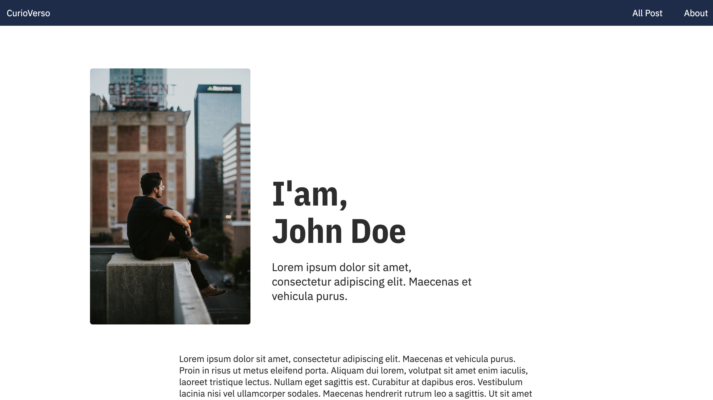

# 2. Definiendo el modelo

## Modelo de datos

En el paso anterior creamos el proyecto y le pusimos un nombre.

Ahora Nos deplazamos al tab de modelo, y vamos a definir la estructura de nuestros datos.

## Modelo de datos de About

Empezamos por lo más fácil, la página de about en la que nos presentamos.



¿Qué contenido va a tener esta página?

- Una foto.
- Un nombre y apellidos.
- Una mini bio.
- Una bio extendida.

Si lo definiéramos con TypeScript, sería algo así como:

```typescript
interface About {
  fullname: string;
  picture: media;
  shortBio: string;
  extendedBio: longtext;
}
```

Vamos a crear la entidad **About** con los campos que hemos definido. Para ello, hacemos click en "Añadir nuevo modelo" y le damos el nombre "About".

Ahora comenzamos a añadir campos. Empezamos por la foto:

- Nombre: **picture**.
- Tipo: media.
- No es una colección, va a ser una sola foto.
- Validaciones: es obligatotorio informar el campo.

Vamos a por el nombre:

- Nombre: **fullname**.
- Tipo: texto corto.
- No es una colección, va a ser un solo nombre.
- Validaciones: es obligatotorio informar el campo.

Ahora la mini bio:

- Nombre: **shortBio**.
- Tipo: texto corto.
- No es una colección, va a ser un solo parráfo.
- Validaciones: es obligatotorio informar el campo.

Y, por último, la bio extendida:

- Nombre: **extendedBio**.
- Tipo: Texto largo (texto largo acepta Markdown).
- No puede ser una colección.
- Validaciones: es obligatotorio informar el campo.

## Modelo de datos de Blog

Vamos al nucleo de nuestro sitio, queremos mostrar posts, para ello vamos a definir la entidad "Post".

¿Qué contenido va a tener un post?

- El título.
- La fecha en que se publicó.
- El autor.
- El resumen del post.
- Una imagen de cabecera.
- El contenido en markdown (con fotos embebidas, código...).

Si fuera pseudoTypescript sería algo así como:

```ts
interface Post {
  title: string;
  date: Date;
  author: string;
  summary: string;
  image: media;
  content: longtext;
}
```

Vamos a crear la entidad **Post** con los campos que hemos definido. Para ello, hacemos click en "Añadir nuevo modelo" y le damos un nombre "Post".

Y comenzamos a añadir campos. Empezamos por el título:

- Nombre: title.
- Tipo: texto corto.
- No es una colección, va a ser un solo título.
- Validaciones: es obligatotorio informar el campo.

Vamos a por la fecha:

- Nombre: date.
- Tipo: fecha.
- No es una colección, va a ser una sola fecha.
- Validaciones: es obligatotorio informar el campo.

Ahora el autor:

- Nombre: author.
- Tipo: texto corto.
- No es una colección, va a ser un solo autor.
- Validaciones: es obligatotorio informar el campo.

El resumen del blog:

- Nombre: summary.
- Tipo: texto corto.
- No es una colección, va a ser un sólo resumen.
- Validaciones: es obligatotorio informar el campo.

La imagen de cabecera del post:

- Nombre: image.
- Tipo: media.
- No es una colección, va a ser un sólo resumen.
- Validaciones: es obligatotorio informar el campo.

Por último, el contenido del post:

- Nombre: content.
- Tipo: Texto largo (texto largo acepta Markdown).
- No puede ser una colección.
- Validaciones: es obligatotorio informar el campo.

Ya tenemos nuestra estructura creada :).

Vamos ahora a introducir datos.
