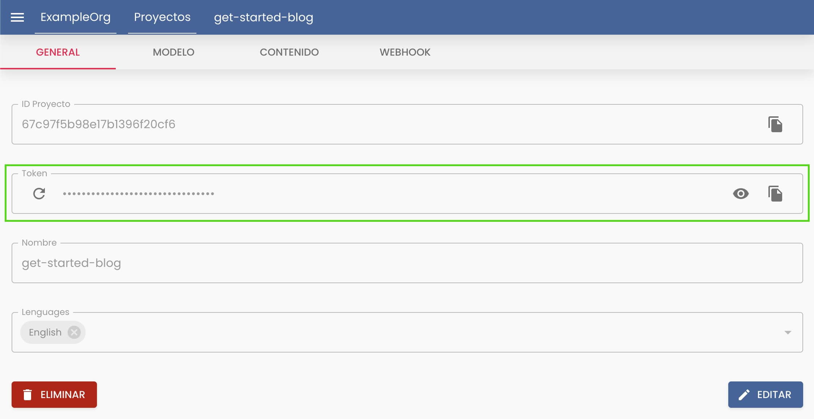

# Setup content Island

Ya estamos listos para empezar a insertar contenido de Content Island en nuestro sitio.

Vamos a hacer el setup de Content Island ¿Qué nos va a hacer falta?

- Instalarnos la librería de B2B de Content Island.
- Añadir una variable de entorno con el API Key de nuestro proyecto en content Island.

Para instalar la librería de B2B de Content Island:

```bash
npm install @content-island/api-client --save
```

También nos hace falta añadir como variable de entorno el API Key de nuestro proyecto en Content Island.

Para ello, nos vamos a content island, elegimos el proyecto en el que estamos trabajando "get-started-blog", y en la pestaña de "General" podemos copiar el API Key (campo _Token_).



Ahora creamos un fichero ".env" en el raíz del proyecto y añadimos la variable de entorno:

```
CONTENT_ISLAND_SECRET_TOKEN=API_KEY
```

Y desde Astro 5, podemos tipar las variables de entorno de esta manera:

_./astro.config.mjs_

```js
import { defineConfig, envField } from 'astro/config';

export default defineConfig({
  env: {
    schema: {
      CONTENT_ISLAND_SECRET_TOKEN: envField.string({
        context: 'server',
        access: 'secret',
        optional: false,
        default: 'INFORM_VALID_TOKEN'
      })
    }
  }
});
```

> Está variable se ejecutará en el servidor, cuando Astro generé el sitio web estático.

Vamos a iniciar ahora la librería de Content Island en nuestro proyecto e inyectarle la API Key.

_./src/lib/client.ts_

```ts
import { CONTENT_ISLAND_SECRET_TOKEN } from 'astro:env/server';
import { createClient } from '@content-island/api-client';

const client = createClient({
  accessToken: CONTENT_ISLAND_SECRET_TOKEN
});

export default client;
```

Y ya tenemos todo listo para empezar a trabajar con Content Island. :)
