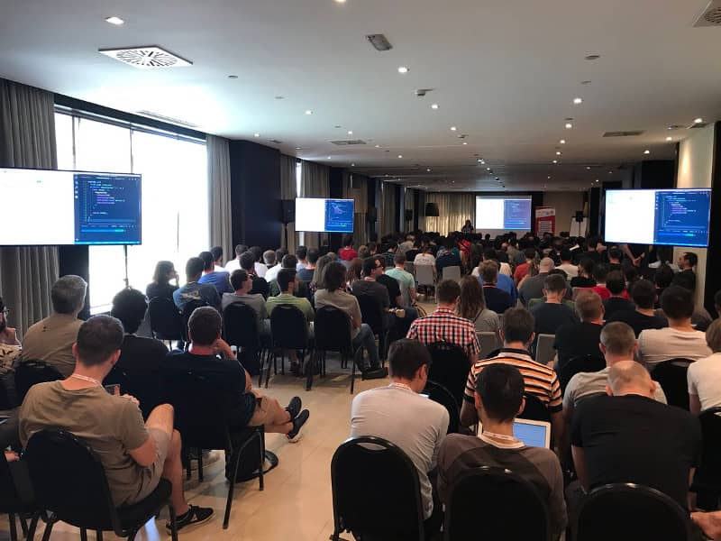

This past September, React Alicante 2024 once again proved why it is one of the most anticipated frontend conferences in Europe. Developers, engineers, and React enthusiasts from all over the world gathered in the beautiful coastal city of Alicante, Spain, for a weekend full of insightful talks, hands-on workshops, and invaluable networking opportunities.

## A Weekend of Learning and Inspiration

The conference featured an impressive lineup of speakers, including industry leaders, core contributors to React, and experienced developers who shared their expertise on the latest trends and innovations in frontend development. Topics ranged from React Server Components and performance optimization to accessibility and new advancements in the React ecosystem.

## Hands-On Workshops

One of the highlights of the event was the selection of hands-on workshops, where attendees had the opportunity to dive deep into cutting-edge technologies and best practices. Whether it was learning how to build better state management solutions or exploring the latest in TypeScript and GraphQL, the workshops provided practical knowledge that attendees could take back to their projects.

## The Community and Networking

Beyond the technical content, React Alicante is known for its strong sense of community. The event provided numerous opportunities for attendees to connect with fellow developers, whether during coffee breaks, at the networking sessions, or at the legendary after-party by the beach. The vibrant atmosphere fostered new collaborations, ideas, and friendships.

## Looking Forward to 2025

React Alicante 2024 was a fantastic experience, bringing together passionate developers and thought leaders to share knowledge and push the React ecosystem forward. If you missed it this year, make sure to mark your calendar for next year's edition—it promises to be even bigger and better!

**Did you attend React Alicante 2024? Share your thoughts and favorite moments in the comments below!**
